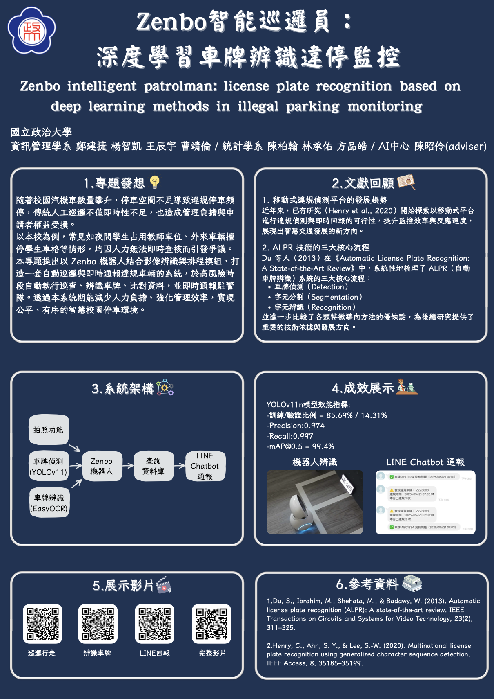
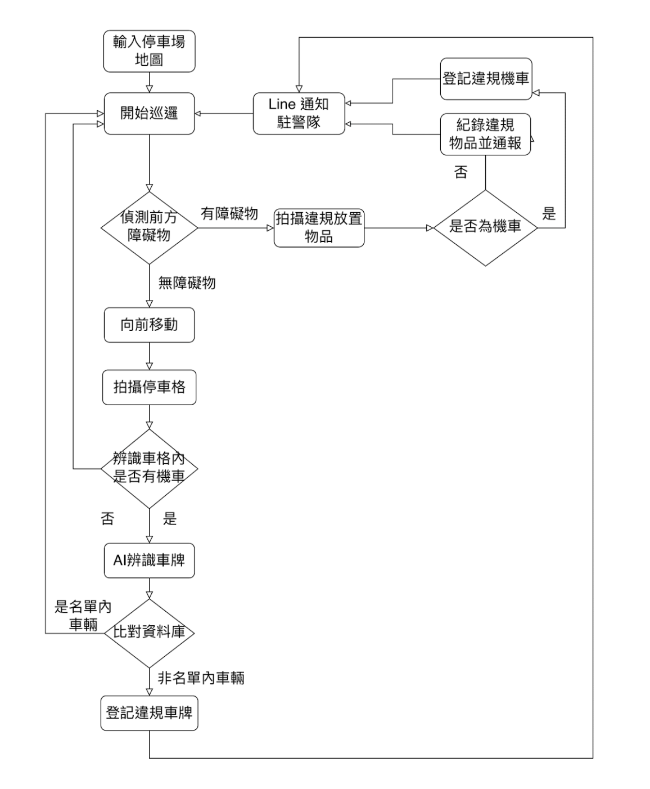

# Zenbo智能巡邏員：深度學習車牌辨識違停監控
Zenbo intelligent patrolman: license plate recognition based on deep learning methods in illegal parking monitoring.

**人工智慧實務專題－機器人與AI應用實作**  [DEMO影片連結](https://youtu.be/doTxv7EyCCM)

- 我負責的內容為：
  - 影像辨識之資料集收集（約兩千多筆照片）
  - 每筆資料的影像標記（labeling)(使用：[HumanSignal-labelImg](https://github.com/HumanSignal/labelImg))
  - yolo模型共同協助訓練與建模
 
- 參加比賽與獲獎記錄：
  - 入圍2025∞AI跨域永續創新競賽「決賽」
  - 2025 NCCU Innofest 期末海報聯展獎

> 主要在本機端做labeling的動作，於colab建立模型與訓練。

***

***

## 研究動機

本研究提出一套以自動巡邏機器人為核心的智慧停車管理系統，並以具備移動與影像辨識能力的 Zenbo 機器人作為平台，搭配車牌辨識與資料比對技術，實現固定時段之自動巡邏、違規偵測與即時通報功能。期望藉由科技輔助，提升校園停車管理效率，減少人力負擔，並保障全體使用者的停車權益，打造更公平、智慧的校園交通環境。本研究亦呼應永續發展目標，嘗試以低成本、可擴散之 AI 應用優化校園基礎設施管理。

## 開發目標
1. 建構違規車輛辨識與即時通報機制
2. 跨時段自動巡邏與比對功能
3. 提升車牌辨識系統在實地環境中的準確率與穩定性
4. 整合 Zenbo 機器人平台以完成低成本巡邏應用
5. 降低人工負擔並強化違規控管效率

## 實驗設計
1. 階段一：模擬環境功能驗證
  - 目的：確認模組整合運作是否順暢，包含辨識、比對與通報流程是否可自動串聯執行
  - 場域設定：教室內部佈置數張印製車牌模擬車輛，並貼上膠帶模擬車格與車道
  - 測試項目：
    - Zenbo 自走巡邏與避障功能
    - 車牌影像擷取與 YOLO 模型辨識
    - 與資料庫進行車牌比對
    - LINE Notify 自動發送違規通報

2. 階段二：實際場域測試（使用者情境二：學生跨區停車）
   - 目的：驗證 Zenbo 於真實光線與柏油停車場環境移動能力
   - 測試時間：下午 13-14 時
   - 測試場域：校園南區停車場
   - 測試項目：
     - 系統設定預定路線巡邏
     - 拍攝車輛車牌進行辨識與比對
     - 通報違規車輛並記錄時間

## 結果分析

1. 辨識準確率分析
   - 採用 YOLOv11n 模型進行車牌偵測，模型效能如下：
     - 訓練集/驗證集比例：85.69% / 14.31%
     - Precision：0.974
     - Recall：0.997
     - mAP@0.5：99.4%
   - 於模擬場域測試中，整體辨識準確率達 98.3%，辨識錯誤主要來自 OCR 模型對於特定模糊字元（如 O / 0, I / 1）辨識失準所致。

2. 比對與通報效率
   - 系統辨識後進行資料庫查詢平均耗時 1.2 秒，觸發 LINE Notify 通報平均延遲約 3.6 秒，符合實際操作所需的即時性要求，整體比對與通知功能表現穩定。

## 小結與後續發展討論

本專題於本學期專題課程以Zenbo機器人實作自走巡邏機器人，可以達到簡易之行走功能——包含沿線行走、轉彎、障礙避開等功能；並且以YOLO模型和EasyOCR來達到自動化辨識車牌；最後串連後端資料庫以及Line帳號實現合法車牌比對流程。

我們將引入完整之影像前處理流程，並提高YOLO以及OCR之辨識率，在辨識方面得到更穩定之結果。並且我們也將結合巡邏機器人模組，實際帶到停車場進行試用並針對結果進行微調，以確保該辨識模組確實能夠應用於實際場域。
在此階段，我們預計停車場夜晚巡邏的完成率應大於95%，且車牌辨識的mAP應大於0.92。
